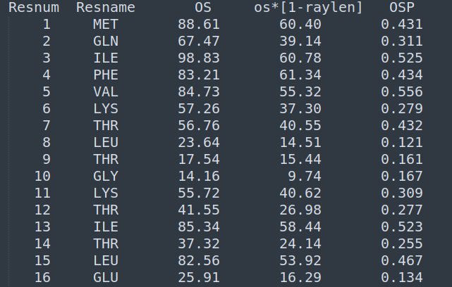
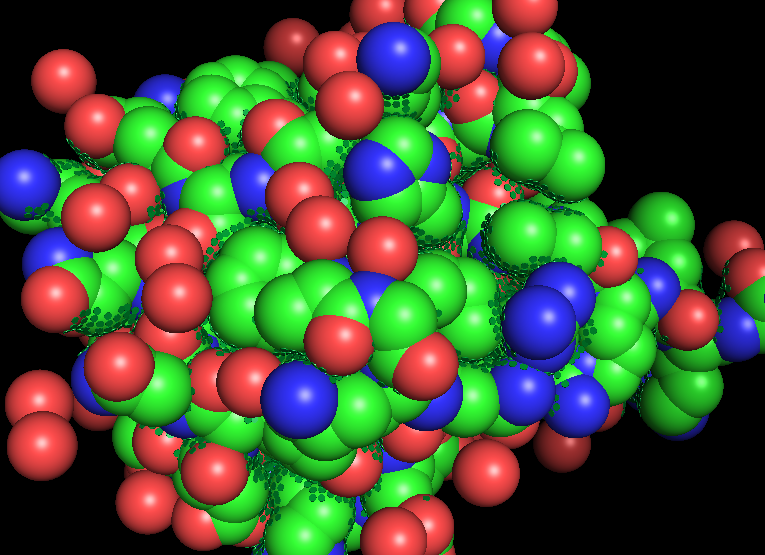
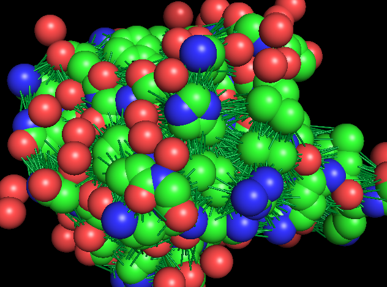

# FIBOS-PY (BETA)

## Description
The FIBOS-PY package was developed with the objective to offer in Python the Occluded Surface methodology, created by Patrick Fleming and coauthors [Pattabiraman, Ward, & Fleming, 1995].

There is also a BETA version of the FIBOS-R package implemented as a library for the R language, which can be accessed at: [FIBOS-R (BETA)](https://github.com/hersonhebert/fibos_r.git).
## Functionalities
The package allows the calculation of occluded surface areas between atoms of a molecule, using as input a PDB code or PDB file.

## Requirements

Firstly, the installation of the 'testresources' package is still necessary. If you do not have, you should use the following command:

For Python 2:
    
    sudo apt install python-testresources

For Python 3:
    
    sudo apt install python3-testresources

The FIBOS library has some dependencies that need to be installed beforehand. Follow the steps below:

1. First, download the file [fibos.yml](https://github.com/hersonhebert/fibos_py/blob/main/fibos.yml).

   ** Note: If you do not have a Conda environment installed, you will need to install it. For this, please refer to the [Docs Anaconda](https://docs.anaconda.com/free/anaconda/install/linux/). 


2. Create a Conda environment using the following command:

        conda env create -f fibos.yml

3. After creating the Conda environment, activate it using the following command:
    
        conda activate fibos-env

These additional libraries are also required:
 - os
 - shutil
 - pkgutils

## How use
### Installing the Package
    
    pip install git+https://github.com/hersonhebert/fibos_py
    
### Using the Package:
In this beta version, some functions were implemented:


1. **occluded_surface**: This function is responsible for computing the occluded areas between atoms and returning the results as a tibble/data frame. Additionally, it generates the prot.srf file as a side effect.

   Parameters:

   - pdb: this can either be the code or path/file of the PDB that represents a protein. If you wish to obtain the file online from the RCSB PDB site, simply enter the PDB code. If the file is saved locally, enter the file path.

   - method: this parameter determines the method used to calculate the occluded areas between atoms. Accepts the strings "OS" (tradicional) or "FIBOS" (experimental).


2. **read_prot**: The function read_prot is applied when reading the prot.srf file, returning a DataFrame so that the user can manipulate the data.

   Parameters:
   
   - prot.srf: "The prot.srf file contains all the information from the calculation of occluded surface and extension of surface normals." You can view more about Prot File in [Prot.srf](https://pages.jh.edu/pfleming/sw/os/prot.srf.html).

3. **respack**:The "respack" function aims to calculate the value of OSP, which is related to the assessment of residue packing.

   Parameters:
   - prot.srf: "The prot.srf file contains all the information from the calculation of occluded surface and extension of surface normals." You can view more about Prot File in [Prot.srf](https://pages.jh.edu/pfleming/sw/os/prot.srf.html).

4. **read_Disp**: For reading the file containing the coordinates and values of dots and normals related to surface occlusion, the function read_Disp is applied, returning a DataFrame so that the user can manipulate the data.

   Parameters:
   
   - raydist.lst: "The file raydist.lst (output by occluded surface function) contains the coordinates, lengths, and normal vectors for the rays of the residue(s).".

5. **pymol_visualize**: Using the "pymol_visualize" function, it is possible to generate visualizations of the dots and rays generated during the execution of the "occluded surface" function.

   Parameters:
   
   - raydist: It is a variable of type DataFrame returned by the read_Disp function.
   - pdb: this can either be the code or path/file of the PDB that represents a protein. If you wish to obtain the file online from the RCSB PDB site, simply enter the PDB code. If the file is saved locally, enter the file path.
   - type: In the "type" option, you can choose how you want to visualize the results of the packing process: as rays  or dots.


## Examples
### First Example: 
Calculating Occluded Surfaces:
```
import fibos
    prot = fibos.occluded_surface("1ubq","FIBOS")
```
Output: 
 - prot.srf file.
 - raydist.lst file.
 - Dataframe of Occluded Surface Values.

### Second Example: 
Readind Prot File:
```
import fibos
    prot = read_prot("prot.srf")
```
Output:
   - Dataframe of Occluded Surface Values.

### Third Example: 
Calculating OSP Value:
```
import fibos
    respack = fibos.respack("prot.srf")
```
Output:



### Fourth Example:
Reading raydist file:
```
import fibos
    raydist = read_Disp("raydist.lst")
```
Output: 

   - Dataframe with rays and dots values.

### Fifth Example:
Generating Dots Visualization:
```
import fibos
    raydist = read_disp("raydist.lst")
    fibos.pymol_visualize(raydist,"1ubq", "dots")
```
Output: 



### Sixth Example: 
Generating Rays Visualization
```
import fibos
    raydist = read_disp("raydist.lst")
    fibos.pymol_visualize(raydist,"1ubq", "rays")
```

Output:



## Authors

- Carlos Silveira:  carlos.silveira@unifei.edu.br
- Herson Soares: d2020102075@unifei.edu.br
- João Romanelli: joaoromanelli@unifei.edu.br
- Patrick Fleming: Pat.Fleming@jhu.edu

## References

Pattabiraman, N., Ward, K. B., & Fleming, P. J. (1995). Occluded molecular surface: Analysis of protein packing. Journal of Molecular Recognition, 8, 334–344. https://doi.org/doi.org/10.1002/jmr.300080603

## Status
In Progress.
